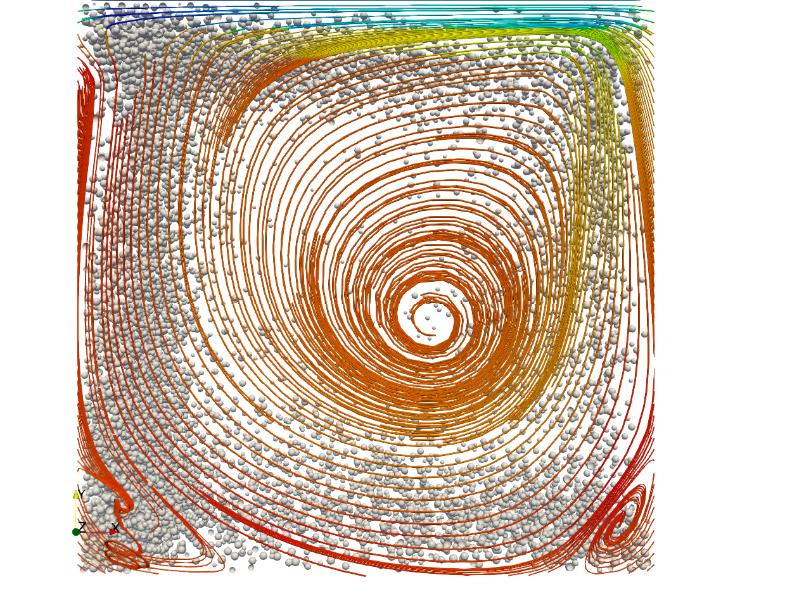

# Yade-OpenFOAM-coupling
An OpenFOAM solver for realizing CFD-DEM simulations with the Open Source Discrete Element Solver Yade-DEM. Two simulation methods 
are available at present : simple point force coupling and full 4-way coupled CFD-DEM simulation. 
Particle Resolved (based on Immersed Boundary Method) solver coming soon. 

Prerequisites : Lates Yade git version with the FoamCoupling engine (https://gitlab.com/yade-dev/trunk). OpenFOAM-6. 

## Build
* Compile the lib FoamYade and solver icoFoamYade : 
  * ``./Allwmake``

## Running 
* Copy example to $FOAM_RUN
* Create a symbolic link
  * ``ln -s /path/to/your/yade/install/bin/yade-exec libyade.py``
* Run 
  * ``cp -r example_icoFoamYade /to/your/run/dir ``
  * ``mpiexec -n 1 python scriptYade.py : -n 2 icoFoamYade -parallel``
  
